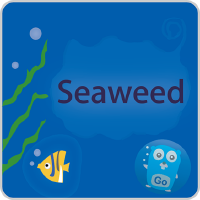

<!-- Improved compatibility of back to top link: See: https://github.com/othneildrew/Best-README-Template/pull/73 -->
<a name="readme-top"></a>
<!--
*** Thanks for checking out the Best-README-Template. If you have a suggestion
*** that would make this better, please fork the repo and create a pull request
*** or simply open an issue with the tag "enhancement".
*** Don't forget to give the project a star!
*** Thanks again! Now go create something AMAZING! :D
-->


<!-- PROJECT SHIELDS -->
<!--
*** I'm using markdown "reference style" links for readability.
*** Reference links are enclosed in brackets [ ] instead of parentheses ( ).
*** See the bottom of this document for the declaration of the reference variables
*** for contributors-url, forks-url, etc. This is an optional, concise syntax you may use.
*** https://www.markdownguide.org/basic-syntax/#reference-style-links
-->


<!-- PROJECT LOGO -->
<br />
<div align="center">
  <a href="https://github.com/jerebear12/seaweedtest">
    
  </a>

<h3 align="center">SeaweedTest</h3>

  <p align="center">
    A C# graphical user interface made to interact with a test seaweedfs instance
    <br />
    <a href="https://github.com/jerebear12/seaweedtest"><strong>View the Code »</strong></a>
  </p>
</div>


<!-- TABLE OF CONTENTS -->
<details>
  <summary>Table of Contents</summary>
  <ol>
    <li>
      <a href="#about-the-project">About The Project</a>
      <ul>
        <li><a href="#built-with">Built With</a></li>
      </ul>
    </li>
    <li>
      <a href="#getting-started">Getting Started</a>
      <ul>
        <li><a href="#prerequisites">Prerequisites</a></li>
        <li><a href="#installation">Installation</a></li>
      </ul>
    </li>
    <li><a href="#usage">Usage</a></li>
  </ol>
</details>


<!-- ABOUT THE PROJECT -->
## About The Project

A C# graphical user interface made to interact with a test seaweedfs instance.
SeaweedTest uses http requests to upload and download files from seaweedfs.
SeaweedTest allows for viewing of files and user based access and storage.
SeaweedTest does not support deletion of files currently.

<p align="right">(<a href="#readme-top">back to top</a>)</p>


### Built With

C#
Windows Forms
RestSharp


<p align="right">(<a href="#readme-top">back to top</a>)</p>


<!-- GETTING STARTED -->
## Getting Started

These are the instructions for installation and operation

### Prerequisites

- Python installed on your machine
- Visual Studio with .Net6.0 or later
- An instance of seaweedfs running with a master, volume, and filer: [How To](https://github.com/seaweedfs/seaweedfs/wiki/Getting-Started)
- The Filer will have to be running with a security.toml file: [Info](https://github.com/seaweedfs/seaweedfs/wiki/Security-Overview#jwt-based-access-control)
- The secret(encryption) key used in this application can be viewed and changed in the app.py file
- The timeout of the secret key *has to be the same in app.py and security.toml*
- Both read and write signing_key(s) are recommended

You will need to install the python flask server to log in and authenticate the user:

# Python Server(Authentication API)
in the flask-server folder run:
* pip
    ```sh
    pip install -r requirements.txt
    ```

### Installation

git clone this repo!

<p align="right">(<a href="#readme-top">back to top</a>)</p>


<!-- USAGE EXAMPLES -->
## Usage

1. Run SeaweedFS as described in [Prerequisites](https://github.com/jerebear12/seaweedtest#Prerequisites)
2. Run app.py - the single file flask server that handles user auth - as described in [Prerequisites](https://github.com/jerebear12/seaweedtest#Prerequisites)
3. Start SeaweedTestMk2.proj from Visual Studio
4. Set and save API and Filer ip addresses in 'Settings'(top right hand corner)
5. Sign up
6. Log in
7. Enjoy!

<p align="right">(<a href="#readme-top">back to top</a>)</p>


<!-- MARKDOWN LINKS & IMAGES -->
<!-- https://www.markdownguide.org/basic-syntax/#reference-style-links -->